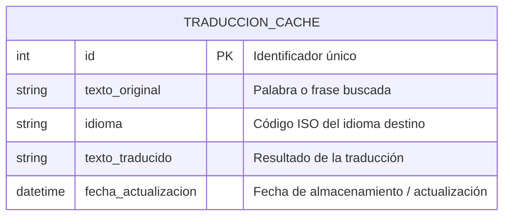

# Requisitos Funcionales

## 1. Gestión de búsquedas
- **RF1:** El sistema debe permitir que el usuario ingrese una palabra o frase en un buscador.  
- **RF2:** El sistema debe almacenar cada búsqueda en la base de datos para evitar consultas repetidas a la API.  
- **RF3:** El sistema debe validar que la entrada no esté vacía antes de realizar la búsqueda.  

## 2. Traducción y cacheo
- **RF4:** El sistema debe verificar si la palabra o frase ya existe en la base de datos para cada idioma del mapa.  
- **RF5:** Si la traducción existe, el sistema debe devolverla desde la base de datos.  
- **RF6:** Si la traducción no existe, el sistema debe solicitarla a la API de traducción, almacenarla en la base de datos y luego mostrarla.  

## 3. Mapamundi interactivo
- **RF7:** El sistema debe mostrar un mapa interactivo con los países identificables.  
- **RF8:** El sistema debe mostrar la traducción de la palabra/frase al hacer clic sobre el país correspondiente en el idioma oficial de ese país.  
- **RF9:** El sistema debe permitir al usuario desplazarse y hacer zoom en el mapa.  

## 4. Experiencia de usuario
- **RF10:** El sistema debe actualizar dinámicamente las traducciones en el mapa al realizar una nueva búsqueda.  
- **RF11:** El sistema debe mostrar un indicador de carga mientras se obtiene la traducción de la API (si no está cacheada).  

## 5. Administración de cache (opcional)
- **RF12:** El sistema debe permitir establecer un tiempo de expiración para las traducciones almacenadas, de modo que se puedan actualizar si la API cambia.

# Requisitos Técnicos (Stack MERN)

## 1. Backend (Node.js + Express)
- **RT1:** El backend debe estar desarrollado en **Node.js**.
- **RT2:** Se debe utilizar **Express.js** para gestionar rutas y controladores.
- **RT3:** Debe exponerse una API REST para:
  - Gestionar las búsquedas de los usuarios.
  - Consultar las traducciones almacenadas.
  - Guardar nuevas traducciones en la base de datos.
- **RT4:** Se debe implementar manejo de errores y validación de datos de entrada.
- **RT5:** Debe permitir la conexión con **MongoDB** para almacenamiento de datos.

## 2. Base de datos (MongoDB)
- **RT6:** Se debe utilizar **MongoDB** como base de datos NoSQL.
- **RT7:** La base de datos debe tener al menos una colección `traducciones` con campos:
  - `texto_original` (String)
  - `idioma` (String)
  - `texto_traducido` (String)
  - `fecha_actualizacion` (Date)
- **RT8:** Se debe crear un índice único sobre `(texto_original, idioma)` para evitar duplicados.
- **RT9:** Debe permitir escalabilidad para almacenar un gran número de traducciones.

## 3. Frontend (React)
- **RT10:** El frontend debe estar desarrollado en **React.js**.
- **RT11:** Debe mostrar un buscador donde el usuario pueda introducir palabras o frases.
- **RT12:** Debe mostrar un **mapamundi interactivo**, con zoom y desplazamiento.
- **RT13:** Las traducciones deben aparecer sobre los países correspondientes en el idioma oficial.
- **RT14:** Debe mostrar indicadores de carga mientras se obtienen las traducciones.

## 4. Integración y comunicación
- **RT15:** La comunicación entre frontend y backend debe realizarse mediante **API REST con JSON**.
- **RT16:** Debe permitir la implementación de un **sistema de cache** para reducir llamadas a la API de traducción externa.

## 5. API de traducción
- **RT17:** Debe integrarse con una **API externa de traducción** (Google Translate, DeepL, etc.).
- **RT18:** La aplicación debe verificar si la traducción ya existe en la base de datos antes de consultar la API externa.

## 6. DevOps / Entorno
- **RT19:** La aplicación debe ser compatible con entornos de desarrollo y producción.
- **RT20:** Se recomienda el uso de **npm o yarn** para gestión de dependencias.
- **RT21:** Se debe configurar **CORS** en el backend para permitir solicitudes desde el frontend.
- **RT22:** Se recomienda el uso de **dotenv** para manejar variables de entorno (API keys, URLs de base de datos, etc.).

# Esquema de Base de Datos - Traducción Cache

# Arquitectura de la Aplicación - Stack MERN

| Componente | Tecnología / Herramienta | Descripción Funcional | Comunicación |
|-------------|---------------------------|------------------------|---------------|
| **Frontend** | **React.js** | Interfaz gráfica donde el usuario introduce palabras o frases y visualiza el mapamundi interactivo con las traducciones. | Se comunica con el backend mediante peticiones HTTP (fetch / Axios). |
| **Gestor de estado** | React Hooks / Context API | Controla el estado de la búsqueda, los resultados y las traducciones mostradas en el mapa. | Interno del frontend. |
| **Backend (Servidor)** | **Node.js + Express.js** | Expone una API REST que recibe las búsquedas, gestiona la lógica de cache y solicita datos a la API externa de traducción si es necesario. | Recibe peticiones del frontend y responde en formato JSON. |
| **Base de datos** | **MongoDB** | Almacena las traducciones ya realizadas para evitar nuevas llamadas a la API externa (cache local). | Conectada al backend mediante Mongoose (ODM). |
| **ORM / Conector** | **Mongoose** | Facilita la comunicación entre Node.js y MongoDB, define el modelo de datos (`TraduccionCache`). | Interno del backend. |
| **API externa de traducción** | Google Translate / DeepL / LibreTranslate | Fuente de traducciones cuando no se encuentra el resultado en la base de datos local. | Consultada por el backend mediante peticiones HTTP. |
| **Entorno y configuración** | Dotenv, CORS, NPM | Manejo de variables de entorno, configuración de acceso entre dominios y gestión de dependencias del proyecto. | Integrado en backend. |

---

### Flujo general de funcionamiento

1. El usuario introduce una palabra o frase en el buscador del frontend (React).  
2. El frontend envía una petición HTTP al backend (Express).  
3. El backend comprueba en MongoDB si la traducción ya existe.  
4. Si **existe**, devuelve la traducción desde la base de datos.  
5. Si **no existe**, consulta la API externa de traducción, guarda el resultado en MongoDB y lo devuelve al frontend.  
6. El frontend actualiza el mapa con las traducciones obtenidas.

# Evaluación de Capacidades del Equipo

## 1. Composición del equipo
| Rol / Perfil | Responsabilidades principales | Nivel de experiencia | Observaciones |
|---------------|-------------------------------|----------------------|----------------|
| **Frontend Developer (React)** | Implementar la interfaz, el mapa interactivo, integración con la API del backend. | Medio / Alto | Conocimientos en React, Hooks, consumo de APIs y diseño responsivo. |
| **Backend Developer (Node.js / Express)** | Desarrollo de la API REST, lógica de negocio, conexión con la base de datos y la API externa. | Medio | Familiarizado con Express, peticiones HTTP y manejo de errores. |
| **Database Manager (MongoDB)** | Diseño del modelo de datos, optimización de consultas y mantenimiento del cache de traducciones. | Medio | Experiencia en modelos NoSQL y uso de Mongoose. |
| **Integrador / Full Stack** | Conexión entre frontend y backend, despliegue del proyecto, integración continua. | Medio / Alto | Capaz de resolver problemas en ambas capas del sistema. |
| **Diseñador UI/UX** | Diseño visual, accesibilidad y experiencia de usuario en el mapa y buscador. | Básico / Medio | Conocimientos de Figma, principios de diseño interactivo. |
| **Project Manager / Coordinador** | Organización del trabajo, seguimiento de tareas, comunicación entre miembros. | Medio | Usa herramientas como Trello o Notion para la gestión ágil. |

---

## 2. Competencias técnicas generales
| Área | Competencia | Nivel del equipo | Comentarios |
|------|--------------|------------------|--------------|
| **Frontend (React.js)** | Uso de componentes, hooks, estados globales, consumo de API REST. | Medio / Alto | Equipo capaz de construir interfaz funcional y dinámica. |
| **Backend (Node.js + Express)** | Creación de endpoints, middlewares, validación de datos, CORS. | Medio | Capacidad de implementar API escalable y modular. |
| **Base de datos (MongoDB)** | Modelado NoSQL, operaciones CRUD, índices. | Medio | Capaces de implementar cache eficiente para traducciones. |
| **API Externa** | Integración con servicios de traducción (Google, DeepL). | Básico / Medio | Requiere prácticas de manejo de claves y límites de uso. |
| **DevOps / Despliegue** | Uso de entornos locales y producción, variables de entorno, npm/yarn. | Medio | Conocen los principios de despliegue, CI/CD opcional. |
| **Control de versiones (Git)** | Uso de ramas, commits y merges en GitHub. | Medio | Flujo de trabajo colaborativo consolidado. |
| **Diseño UI/UX** | Prototipado, paleta de colores, responsividad. | Básico / Medio | Puede apoyarse en plantillas o librerías UI. |

---

## 3. Fortalezas del equipo
- Conocimiento básico del **stack MERN**.  
- Buena comunicación y división clara de roles.  
- Capacidad para trabajar con APIs externas.  
- Enfoque en el rendimiento y la experiencia del usuario.  

---

## 4. Áreas de mejora
- Mayor experiencia en **optimización de rendimiento del mapa interactivo**.  
- Profundizar en **buenas prácticas de seguridad y manejo de claves API**.  
- Perfeccionar **diseño visual y experiencia de usuario (UX)**.
- Profundizar en el conocimiento del stack MERN.

---

## 5. Conclusión
El equipo posee las competencias necesarias para desarrollar con éxito el proyecto **Mapamundi Interactivo Traductor** utilizando el stack MERN.  
Las áreas a reforzar se centran en optimización visual, seguridad y escalabilidad futura, pero las capacidades actuales son **suficientes para garantizar la viabilidad técnica del proyecto.**   

# Análisis de riesgos y mitigaciones

| **Riesgo** | **Descripción** | **Probabilidad** | **Impacto** | **Estrategia de mitigación** |
|-------------|------------------|------------------|--------------|-------------------------------|
| **Sobrecarga de la API de traducción** | El uso intensivo del servicio de traducción (por múltiples usuarios o consultas simultáneas) podría superar los límites gratuitos o provocar bloqueos. | Media | Alta | Implementar un sistema de caché local de traducciones (`TRADUCCION_CACHE`) para reutilizar resultados previos y reducir llamadas a la API. |
| **Fallas de conectividad con la API** | Si el servicio externo de traducción o el servidor del mapa deja de estar disponible, la aplicación perdería funcionalidad. | Media | Media | Añadir manejo de errores y mensajes informativos al usuario; permitir funcionamiento básico con datos almacenados en caché. |
| **Problemas de compatibilidad en navegadores** | Diferencias en el soporte de tecnologías web (SVG, WebGL, etc.) podrían afectar la visualización. | Baja | Media | Realizar pruebas multiplataforma y aplicar polyfills o librerías estándar (ej. D3.js o Leaflet). |
| **Gestión inadecuada del almacenamiento local** | Si el sistema de caché no se controla correctamente, puede crecer sin límites o almacenar datos obsoletos. | Media | Media | Establecer un mecanismo de expiración de datos y limpieza periódica. |
| **Falta de experiencia técnica en alguna área** | Algunos miembros del equipo pueden tener menor dominio en frontend avanzado o consumo de APIs. | Media | Alta | Repartir tareas según fortalezas, usar documentación oficial y fomentar *pair programming* y aprendizaje conjunto. |
| **Errores en la traducción automática** | Las traducciones pueden no ser precisas en todos los idiomas o contextos. | Alta | Media | Avisar al usuario que las traducciones son automáticas; permitir sugerencias o reportes de errores. |
| **Escalabilidad futura** | La arquitectura inicial puede no soportar fácilmente un aumento masivo de usuarios o nuevas funciones. | Baja | Alta | Diseñar una arquitectura modular, con servicios desacoplados y posibilidad de migrar a microservicios o nube si crece el proyecto. |

